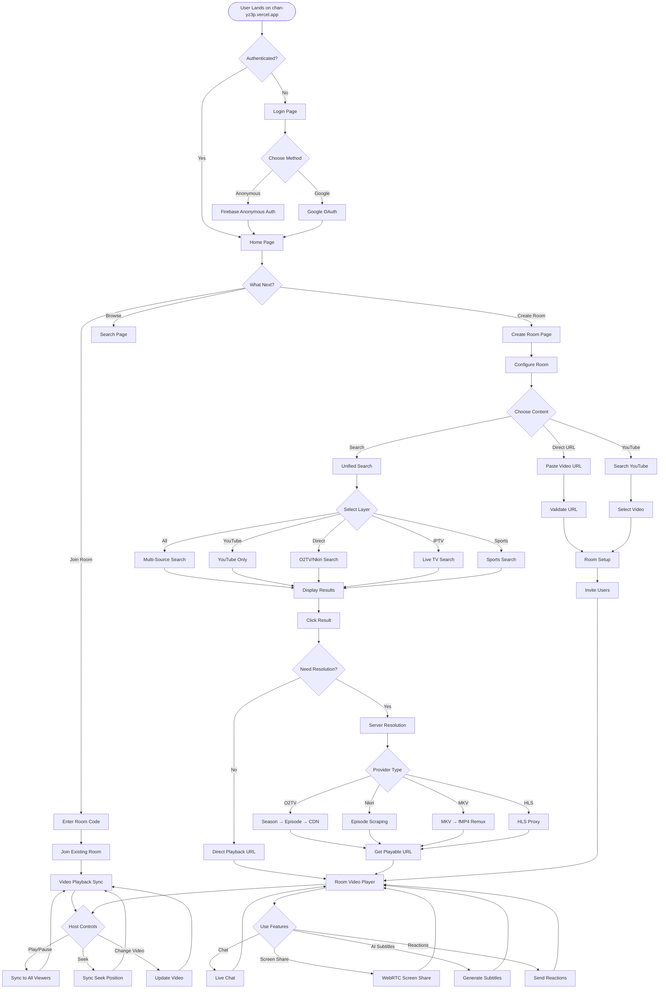
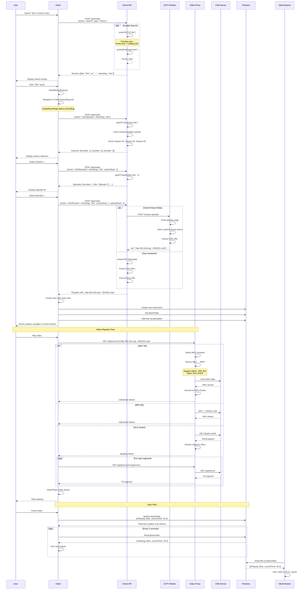
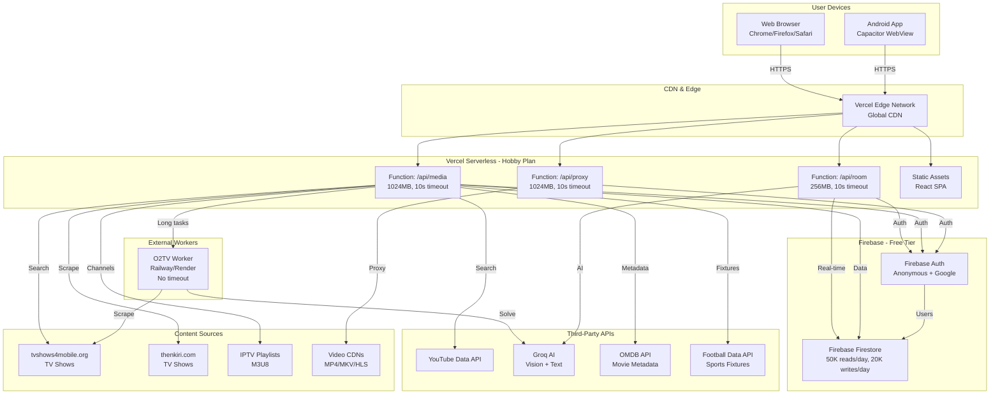
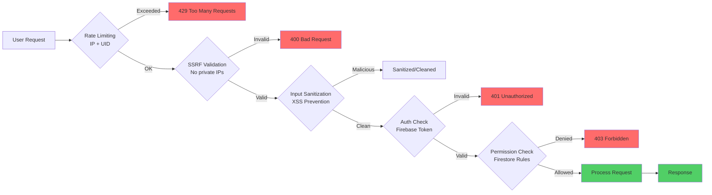

# Chan Platform - User Journey & Architecture

## 🎬 User Journey Flow



## 🏗️ Platform Architecture

```mermaid
graph TB
    subgraph "Client Layer"
        Browser[Web Browser]
        Android[Android App<br/>Capacitor]
        
        Browser --> ReactApp[React SPA]
        Android --> ReactApp
        
        ReactApp --> Components[UI Components]
        Components --> VideoPlayer[Video Player<br/>hls.js + react-player]
        Components --> ChatUI[Chat Interface]
        Components --> SearchUI[Search Interface]
        Components --> RoomUI[Room Management]
    end
    
    subgraph "Authentication Layer"
        Firebase[ Firebase Auth ]
        Google[Google OAuth]
        Anonymous[Anonymous Auth]
        
        Firebase --> Google
        Firebase --> Anonymous
    end
    
    subgraph "Real-time Sync Layer"
        Firestore[ Firestore ]
        Rooms[Rooms Collection]
        Messages[Messages]
        PlayerState[Player State]
        Participants[Participants]
        
        Firestore --> Rooms
        Rooms --> Messages
        Rooms --> PlayerState
        Rooms --> Participants
    end
    
    subgraph "API Layer - Vercel Serverless"
        Vercel[Vercel Functions<br/>10s timeout]
        
        RoomAPI[/api/room<br/>Room Management]
        MediaAPI[/api/media<br/>Search & Scrape]
        ProxyAPI[/api/proxy<br/>Video Proxy]
        
        Vercel --> RoomAPI
        Vercel --> MediaAPI
        Vercel --> ProxyAPI
    end
    
    subgraph "Server Libraries"
        MKVRemux[MKV Remuxer<br/>HEVC/VP9/AV1]
        O2TVResolver[O2TV Resolver]
        NkiriResolver[Nkiri Scraper]
        HLSParser[HLS Parser]
        SSRF[SSRF Protection]
        RateLimit[Rate Limiting]
        
        MediaAPI --> MKVRemux
        MediaAPI --> O2TVResolver
        MediaAPI --> NkiriResolver
        ProxyAPI --> MKVRemux
        ProxyAPI --> HLSParser
        MediaAPI --> SSRF
        MediaAPI --> RateLimit
    end
    
    subgraph "External Content Sources"
        YouTube[YouTube API]
        O2TV[tvshows4mobile.org]
        Nkiri[thenkiri.com]
        IPTV[IPTV Playlists]
        SportsAPI[Football Data API]
        OMDB[OMDB API]
    end
    
    subgraph "Video Sources"
        CDN1[CDN Server 1]
        CDN2[CDN Server 2]
        CDN3[CDN Server 3]
        MKVFiles[MKV Files]
        HLSStreams[HLS Streams]
    end
    
    subgraph "Worker Layer - Railway/Render"
        O2TVWorker[O2TV Worker<br/>No timeout limit]
        CaptchaSolver[Captcha Solver]
        GroqAI[Groq AI Vision]
        
        O2TVWorker --> CaptchaSolver
        O2TVWorker --> GroqAI
    end
    
    subgraph "AI Services"
        Groq[Groq API]
        SubtitleGen[Subtitle Generation]
        SceneAnalysis[Scene Analysis]
    end
    
    %% Client connections
    ReactApp -->|Auth| Firebase
    ReactApp -->|Real-time| Firestore
    ReactApp -->|API Calls| Vercel
    VideoPlayer -->|Stream| ProxyAPI
    
    %% API connections
    RoomAPI --> Firestore
    MediaAPI --> YouTube
    MediaAPI --> O2TV
    MediaAPI --> Nkiri
    MediaAPI --> IPTV
    MediaAPI --> SportsAPI
    MediaAPI --> OMDB
    
    %% Proxy connections
    ProxyAPI --> CDN1
    ProxyAPI --> CDN2
    ProxyAPI --> CDN3
    ProxyAPI --> MKVFiles
    ProxyAPI --> HLSStreams
    
    %% Worker connections
    MediaAPI -->|Long tasks| O2TVWorker
    O2TVResolver -->|Offload| O2TVWorker
    O2TVWorker --> O2TV
    O2TVWorker --> Groq
    
    %% AI connections
    RoomAPI --> Groq
    Groq --> SubtitleGen
    Groq --> SceneAnalysis
```

## 🔄 Data Flow: Search & Playback



## 🏢 Infrastructure Overview



## 📊 Key Metrics & Constraints

| Component | Constraint | Current Usage |
|-----------|-----------|---------------|
| **Vercel Functions** | 10s timeout | O2TV worker offloads long tasks |
| **Vercel Memory** | 1024MB max | Sufficient for MKV remuxing |
| **Firestore Reads** | 50K/day | ~20K/day typical |
| **Firestore Writes** | 20K/day | ~8K/day typical |
| **Firestore Storage** | 1GB | ~200MB used |
| **YouTube API** | 10K units/day | ~2K units/day |
| **Groq AI** | Rate limited | Used for captchas + subtitles |
| **MKV Remux** | 80MB max input | Handles most episodes |
| **Proxy Chunk** | 5MB per request | Streams large files |

## 🔐 Security Layers


